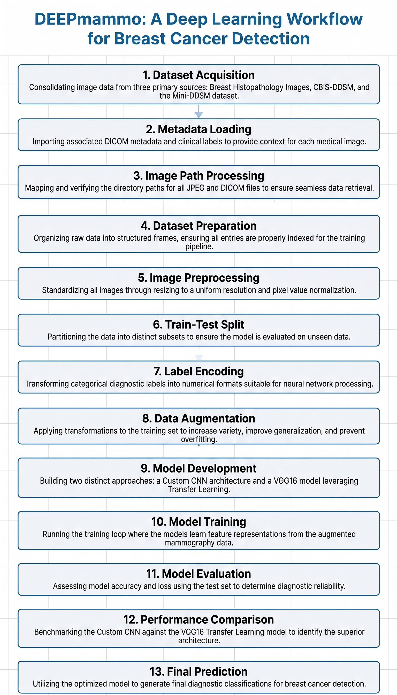
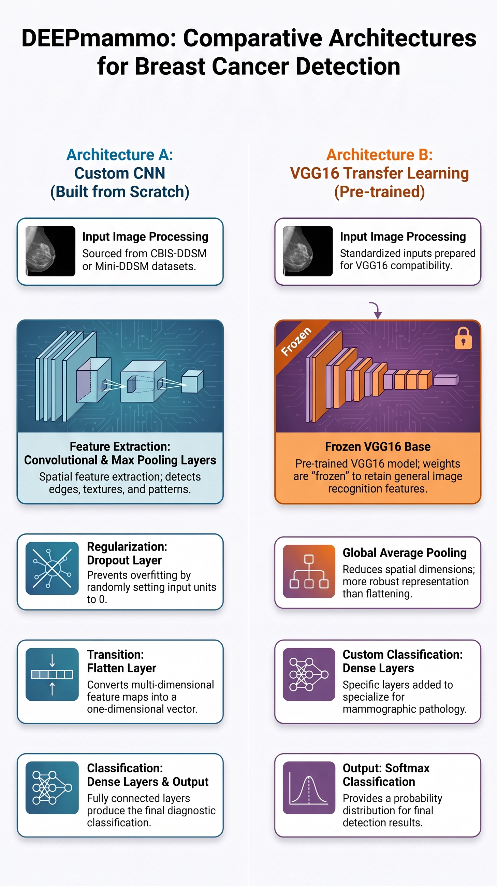

# Breast Cancer Detection using CNN and VGG16 Transfer Learning

A deep learning project for classifying mammogram images as **Benign** or **Malignant** using Convolutional Neural Networks (CNN) and Transfer Learning with VGG16. This project compares a custom CNN model with a pretrained VGG16 model to evaluate their performance on breast cancer image classification.

---

## Project Overview

Breast cancer is one of the leading causes of cancer-related deaths among women worldwide. Early diagnosis through mammography can significantly improve treatment outcomes. Manual interpretation of mammograms can be time-consuming and may vary between radiologists.

This project explores the use of deep learning techniques to automate the classification of mammogram images and compares the performance of a custom-built CNN with a pretrained VGG16 network.

---

## Objectives

- Develop an automated breast cancer classification model.
- Perform preprocessing on mammogram images.
- Train a custom CNN model.
- Implement Transfer Learning using VGG16.
- Compare both models based on classification performance.
- Visualize predictions and evaluation metrics.

---

## Dataset

**Dataset Used**

CBIS-DDSM (Curated Breast Imaging Subset of the Digital Database for Screening Mammography)

The dataset contains:

- Mammogram images
- Cropped lesion images
- ROI images
- DICOM metadata
- Benign and Malignant labels

Dataset includes metadata CSV files describing each case along with corresponding mammogram images.

---


## Project Workflow

<p align="center">
  
</p>

# Methodology

## 1. Data Loading

The DICOM metadata and case description CSV files are loaded from the CBIS-DDSM dataset. Image paths are extracted and corrected to locate mammogram images correctly.

---

## 2. Dataset Preparation

The following image categories are identified:

- Full Mammograms
- Cropped Images
- ROI Images

Metadata from multiple CSV files is merged to generate a clean dataset containing:

- Image path
- Patient information
- Pathology label

---

## 3. Image Preprocessing

Each mammogram image is:

- Loaded in grayscale
- Resized
- Converted to RGB format
- Stored as NumPy arrays

Two image sizes are used:

- 50 × 50 (Custom CNN)
- 150 × 150 (VGG16)

---

## 4. Data Normalization

Pixel values are normalized to improve training stability.

```
Pixel Range

0–255

↓

0–1
```

---

## 5. Dataset Splitting

The dataset is divided into:

- Training Set
- Testing Set

Labels are converted into categorical format before training.

---

## 6. Data Augmentation

To improve model generalization, ImageDataGenerator is used with:

- Rotation
- Zoom
- Width Shift
- Height Shift
- Horizontal Flip
- Shear Transformation

---
## Model Architecture Comparison

<p align="center">
  
</p>
---
# Model 1 – Custom CNN

The first model is a Sequential CNN built from scratch.

Architecture includes:

- Convolution Layers
- ReLU Activation
- Max Pooling
- Dropout Layers
- Dense Layers
- Softmax Output

The model is trained using augmented mammogram images.

---

# Model 2 – Transfer Learning (VGG16)

The second model uses the pretrained VGG16 network.

Steps performed:

- Load pretrained VGG16 weights
- Freeze convolutional layers
- Add custom classifier
- Train only the top layers
- Fine-tune for mammogram classification

Transfer learning helps improve feature extraction using knowledge learned from ImageNet.

---

# Training Strategy

Training includes:

- Early Stopping
- Reduce Learning Rate on Plateau
- Adam Optimizer
- Data Augmentation

These techniques help reduce overfitting and improve convergence.

---

# Model Evaluation

The models are evaluated using:

- Accuracy
- Loss
- Confusion Matrix
- Classification Report
- Validation Curves

Training and validation performance are plotted for both models.

---

# Model Comparison

Both models are compared based on:

- Validation Accuracy
- Validation Loss
- Prediction Performance
- Generalization Ability

A final comparison is performed to determine the better-performing architecture.

---

# Prediction

The project performs prediction on unseen mammogram images using both models.

Predictions include:

- Actual Label
- Predicted Label
- Confidence Score

A head-to-head comparison between CNN and VGG16 is also performed on sample images.

---

# Technologies Used

- Python
- TensorFlow
- Keras
- OpenCV
- NumPy
- Pandas
- Matplotlib
- Plotly
- Scikit-learn
- Pillow

---

# Project Structure

```
Breast-Cancer-Detection-Using-CNN-VGG16/

│── notebook/
│     deepmammo-cnn-vgg16.ipynb
│
│── images/
│
│── results/
│
│── requirements.txt
│
│── README.md
```

---

# Future Improvements

- Improve dataset balancing.
- Experiment with EfficientNet and ResNet architectures.
- Perform hyperparameter optimization.
- Deploy the model using Streamlit or Flask.
- Integrate Grad-CAM for model explainability.
- Validate the model on additional mammography datasets.

---

# References

- CBIS-DDSM Dataset
- TensorFlow Documentation
- Keras Documentation
- VGG16 Research Paper
