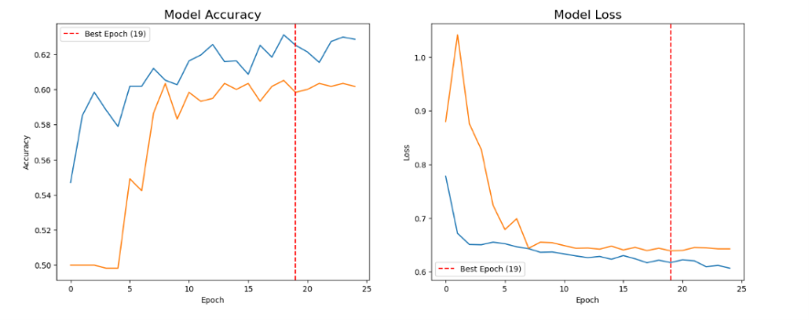
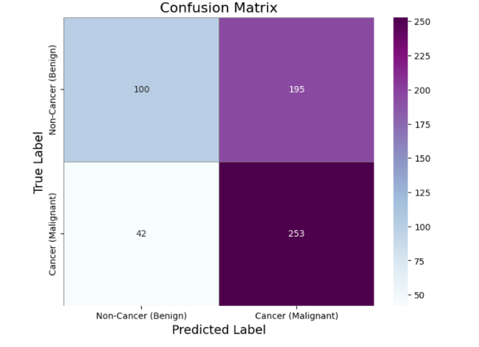
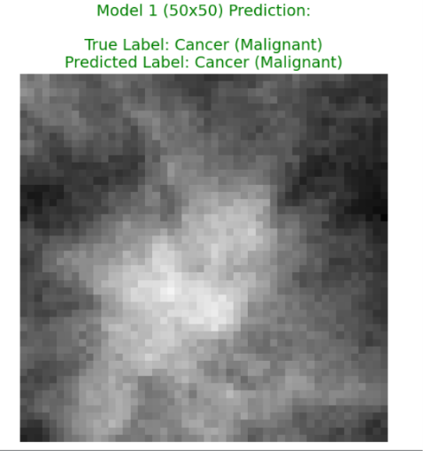
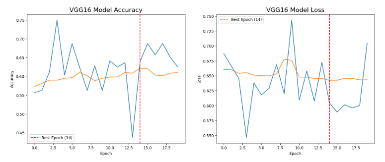
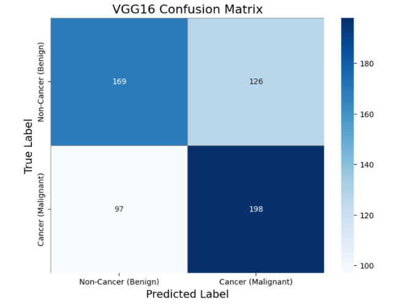
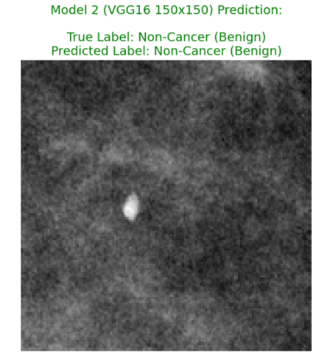

# Breast Cancer Detection using CNN and VGG16 Transfer Learning

<p align="center">
  
</p>

<p align="center">
A Deep Learning project for automated breast cancer classification from mammogram images using a custom Convolutional Neural Network (CNN) and VGG16 Transfer Learning.
</p>

---

## Project Overview

Breast cancer is one of the leading causes of cancer-related deaths among women worldwide. Early detection through mammography plays a critical role in improving patient survival and reducing mortality. However, manual interpretation of mammograms is time-consuming and subject to inter-observer variability.

This project explores the application of Deep Learning for automatic breast cancer classification using mammographic images. Two different approaches are implemented and compared:

- **Custom Convolutional Neural Network (CNN)**
- **Transfer Learning using VGG16**

The objective is to evaluate whether transfer learning can improve classification performance compared to a CNN trained from scratch.

---

## Objectives

- Develop an automated breast cancer classification system.
- Perform preprocessing of mammography images.
- Build and train a custom CNN architecture.
- Implement Transfer Learning using the pretrained VGG16 model.
- Compare the performance of both models.
- Evaluate models using multiple classification metrics.
- Visualize predictions on unseen mammogram images.

---

## Dataset

### CBIS-DDSM Dataset

This project uses the **Curated Breast Imaging Subset of the Digital Database for Screening Mammography (CBIS-DDSM)**, one of the most widely used public mammography datasets for breast cancer research.

The dataset contains:

- Full mammogram images
- Cropped lesion images
- ROI (Region of Interest) images
- DICOM metadata
- Benign and Malignant pathology labels
- Case description CSV files

The metadata files are merged with the corresponding mammogram images to build the final dataset used for training and evaluation.

**Dataset Source**

https://www.cancerimagingarchive.net/collection/cbis-ddsm/

---

## Methodology

### 1. Data Loading

The DICOM metadata and case description CSV files are loaded from the CBIS-DDSM dataset.

The project extracts:

- Mammogram image paths
- Patient information
- Lesion descriptions
- Pathology labels

Image paths are validated and corrected before preprocessing.

---

### 2. Dataset Preparation

Three image categories are identified from the dataset:

- Full Mammograms
- Cropped Lesion Images
- ROI Images

Relevant metadata from multiple CSV files is merged to create a clean dataset containing:

- Image path
- Patient ID
- Breast density
- Abnormality information
- Pathology label

---

### 3. Image Preprocessing

Each mammogram undergoes the following preprocessing steps:

- Load image in grayscale
- Resize image
- Convert grayscale image to RGB
- Convert to NumPy array
- Normalize pixel values

Two different image resolutions are used:

| Model | Input Size |
|--------|------------|
| Custom CNN | **50 × 50** |
| VGG16 | **150 × 150** |

---

### 4. Data Normalization

Pixel values are normalized to improve model convergence.

```text
Original Pixel Range

0 – 255

↓

Normalized Range

0 – 1
```

---

### 5. Dataset Splitting

The processed dataset is divided into:

- Training Set
- Testing Set

The pathology labels are converted into categorical format using one-hot encoding before training.

---

### 6. Data Augmentation

To improve generalization and reduce overfitting, **ImageDataGenerator** is used with the following transformations:

- Rotation
- Zoom
- Width Shift
- Height Shift
- Horizontal Flip
- Shear Transformation

These augmentations increase the diversity of the training dataset without collecting additional images.

---

## Model Architecture

<p align="center">
  
</p>

---

## Model 1 – Custom CNN

The first model is a Sequential Convolutional Neural Network designed specifically for mammogram image classification.

The architecture includes:

- Convolution Layers
- ReLU Activation
- Max Pooling Layers
- Dropout Layers
- Fully Connected Dense Layers
- Softmax Output Layer

The model is trained from scratch using the augmented mammography dataset.

---

## Model 2 – Transfer Learning (VGG16)

The second model utilizes the pretrained **VGG16** architecture.

The workflow includes:

- Load pretrained VGG16 weights
- Freeze convolutional layers
- Add custom fully connected classification layers
- Train only the newly added layers
- Fine-tune the model for mammogram classification

Transfer learning enables the model to leverage powerful visual features learned from the ImageNet dataset, improving feature extraction and classification performance.

---

## Training Strategy

Both models are trained using several techniques to improve convergence and reduce overfitting.

### Optimization

- Adam Optimizer
- Categorical Cross-Entropy Loss

### Callbacks

- Early Stopping
- Reduce Learning Rate on Plateau

### Regularization

- Dropout Layers
- Data Augmentation

These techniques help stabilize training while improving model generalization on unseen mammogram images.

---
## Model Evaluation

Both models are evaluated using multiple performance metrics to assess their classification capability on unseen mammogram images.

The evaluation includes:

- Accuracy
- Training Loss
- Validation Loss
- Confusion Matrix
- Classification Report
- Prediction Visualization

---

## CNN Training Performance

The custom CNN model was trained using augmented mammogram images with early stopping and learning rate scheduling to improve convergence.

<p align="center">
  
</p>

---

## CNN Confusion Matrix

The confusion matrix illustrates the classification performance of the custom CNN model on the testing dataset.

<p align="center">
  
</p>

---

## CNN Prediction

Example prediction generated by the custom CNN model.

<p align="center">
  
</p>

---

## VGG16 Training Performance

The pretrained VGG16 model demonstrates stable convergence by leveraging transfer learning from ImageNet.

<p align="center">
  
</p>

---

## VGG16 Confusion Matrix

The confusion matrix summarizes the classification results obtained using the VGG16 model.

<p align="center">
  
</p>

---

## VGG16 Prediction

Example prediction generated by the VGG16 model.

<p align="center">
  
</p>

---

## Model Comparison

The performance of both models is compared using identical preprocessing and evaluation procedures.

| Feature | Custom CNN | VGG16 Transfer Learning |
|----------|------------|-------------------------|
| Architecture | Sequential CNN | Pretrained VGG16 |
| Input Size | 50 × 50 | 150 × 150 |
| Feature Extraction | Learned from scratch | Transfer Learning |
| Training Speed | Faster | Slower |
| Feature Representation | Moderate | Strong |
| Generalization | Good | Better |

Overall, the VGG16 model benefits from pretrained convolutional layers, allowing it to learn richer visual representations and achieve better generalization on mammography images.

---

## Results Summary

- Successfully developed an automated breast cancer classification pipeline.
- Performed preprocessing and augmentation of mammography images.
- Trained and evaluated a custom CNN model.
- Implemented Transfer Learning using VGG16.
- Compared both architectures using multiple evaluation metrics.
- Demonstrated the effectiveness of transfer learning for medical image classification.

---

## Technologies Used

| Category | Tools |
|----------|-------|
| Programming Language | Python |
| Deep Learning | TensorFlow, Keras |
| Image Processing | OpenCV, Pillow |
| Data Processing | NumPy, Pandas |
| Visualization | Matplotlib, Plotly |
| Machine Learning | Scikit-learn |

---

## Installation

Clone the repository:

```bash
git clone https://github.com/Rahul-2-specs/Breast-Cancer-Detection-Using-CNN-VGG16.git
```

Move into the project directory:

```bash
cd Breast-Cancer-Detection-Using-CNN-VGG16
```

Install the required dependencies:

```bash
pip install -r requirements.txt
```

---

## Usage

1. Download the CBIS-DDSM dataset.
2. Update the dataset paths in the notebook.
3. Install all required dependencies.
4. Run the notebook sequentially.
5. Train the CNN and VGG16 models.
6. Evaluate the trained models.
7. Visualize predictions on unseen mammogram images.

---

## Project Structure

```text
Breast-Cancer-Detection-Using-CNN-VGG16/
│
├── README.md
├── requirements.txt
├── deepmammo-cnn-vgg16.ipynb
│
├── images/
│   ├── DEEPmammo_Breast_Cancer_Detection_Workflow.png
│   ├── Breast_Cancer_Detection_Architecture_Comparison.png
│   ├── cnn_training.png
│   ├── cnn_confusion_matrix.png
│   ├── cnn_prediction.png
│   ├── vgg16_training.png
│   ├── vgg16_confusion_matrix.png
│   └── vgg16_prediction.png
│
└── results/
```

---

## Future Improvements

Potential enhancements for this project include:

- Training on larger mammography datasets.
- Implementing EfficientNet, ResNet, or DenseNet architectures.
- Hyperparameter optimization using automated search techniques.
- Integrating Grad-CAM for model interpretability.
- Deploying the model as a web application using Streamlit or Flask.
- Extending the system for multi-class breast lesion classification.

---

## References

1. CBIS-DDSM Dataset  
   https://www.cancerimagingarchive.net/collection/cbis-ddsm/

2. TensorFlow Documentation  
   https://www.tensorflow.org/

3. Keras Documentation  
   https://keras.io/

4. Simonyan, K., & Zisserman, A. (2015).  
   **Very Deep Convolutional Networks for Large-Scale Image Recognition (VGG16).**  
   https://arxiv.org/abs/1409.1556

---

<p align="center">
<b>If you found this project helpful, consider giving it a ⭐ on GitHub.</b>
</p>
